<h1 align="center">DockLite</h1>

<p align="center"><b>Turn a Linux server into a web host.</b><br>
Sites, databases, HTTPS, backups and DNS, managed from one neon-lit dashboard, a command line, or a terminal UI.</p>

<p align="center">
  
  
  
</p>

<p align="center">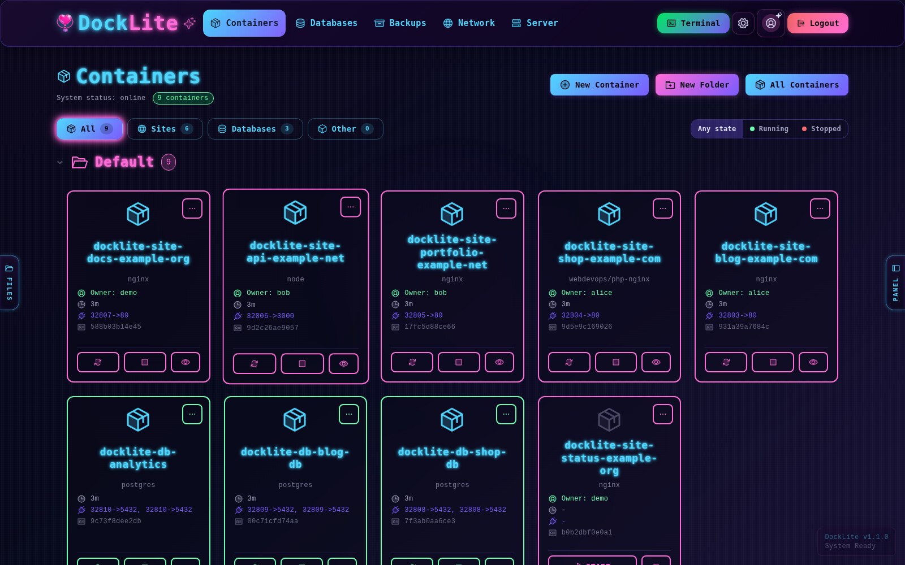</p>

DockLite runs your websites and databases in Docker containers, puts
nginx in front, gets HTTPS certificates, and gives you a dashboard, a command line and a terminal UI to manage it
all. It is built to be safe to run on a server that already hosts live sites.

- Create a **static, PHP or Node** site for a domain in a couple of clicks. Each one gets its own container,
  nginx config and Let's Encrypt certificate (plain HTTP validation or a Cloudflare API token).
- **Postgres databases** in containers, with an in-dashboard inspector and per-user permissions.
- **Backups** of sites and databases with live progress and verification.
- **DNS and SSL** controls for Cloudflare zones.
- **Users and roles** (super admin, admin, user); each person sees only their own sites.
- A **web terminal** into any container, plus server logs and service controls.
- A **`docklite` command line** that does everything the dashboard does, with `--json` output and a built-in
  guide that AI assistants can use too.
- Nothing runs as root except one small, validated helper script.

> DockLite is young and moving fast. See the [roadmap](#roadmap) for what is still planned.

## A look around

<table>
  <tr>
    <td width="50%">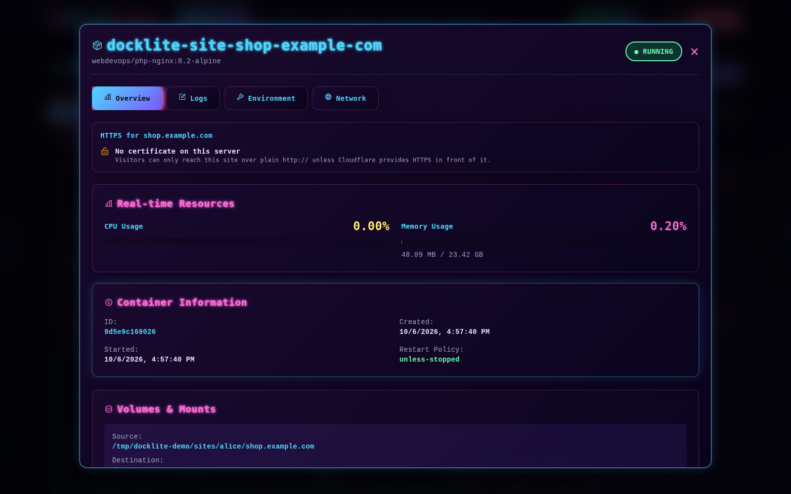<br><sub><b>Container details</b>: live resources, HTTPS status, mounts, logs</sub></td>
    <td width="50%">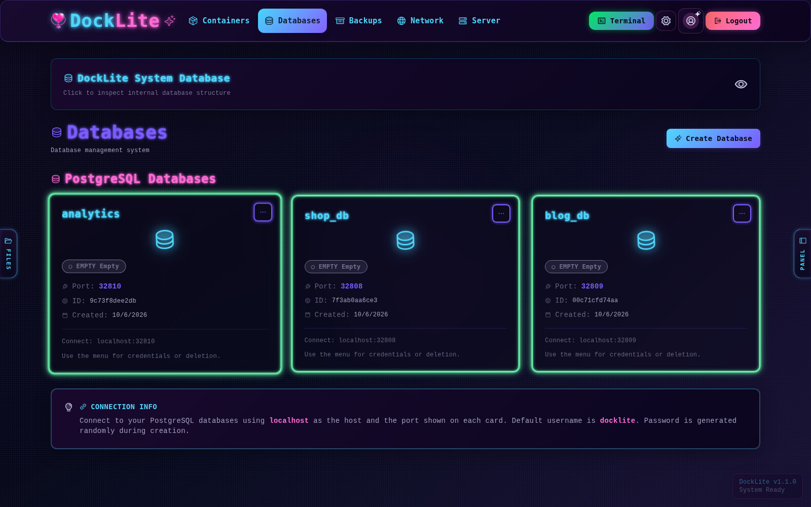<br><sub><b>Databases</b>: Postgres in a container, with an inspector</sub></td>
  </tr>
  <tr>
    <td>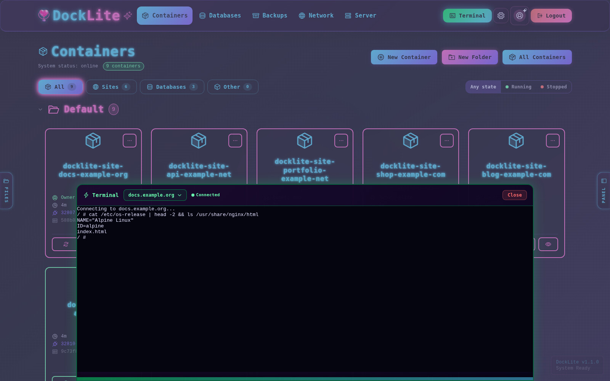<br><sub><b>Web terminal</b> into any container</sub></td>
    <td>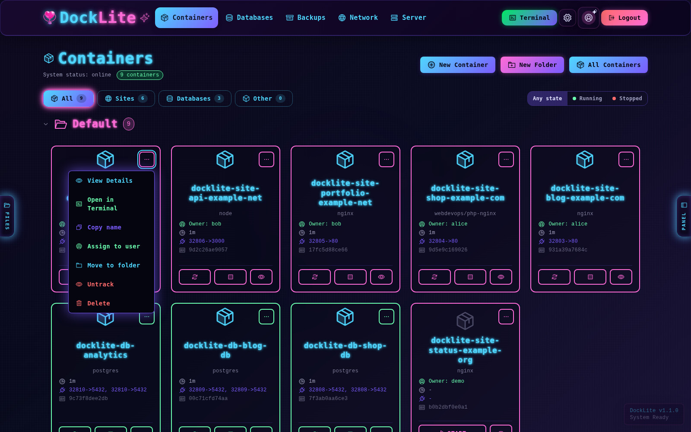<br><sub><b>One menu</b> for details, terminal, assign, move and delete</sub></td>
  </tr>
  <tr>
    <td>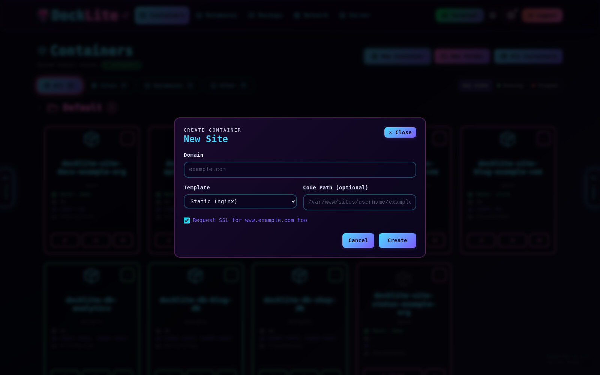<br><sub><b>New site</b>: a domain and a template</sub></td>
    <td>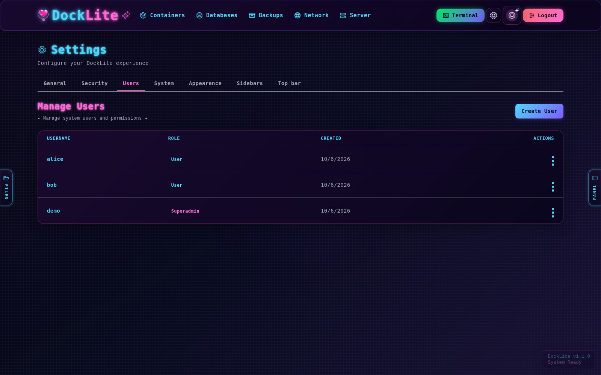<br><sub><b>Users and roles</b>: everyone sees only their own sites</sub></td>
  </tr>
</table>

## Make it yours

Pick a look in **Settings → Appearance**, and rebuild the top bar by dragging items right on it. The sidebars are
optional too.

<table>
  <tr>
    <td width="50%">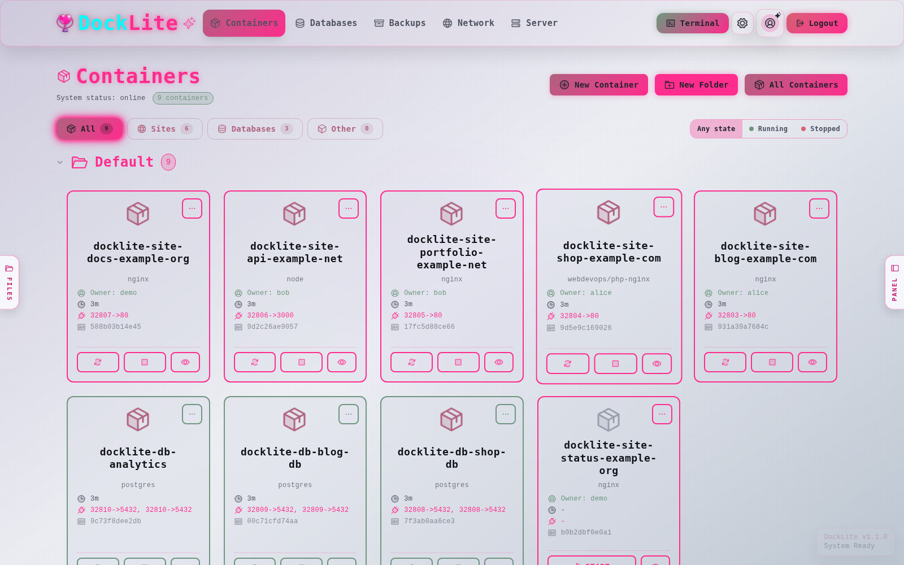<br><sub><b>Corpo</b>: clean greys with soft pink</sub></td>
    <td width="50%">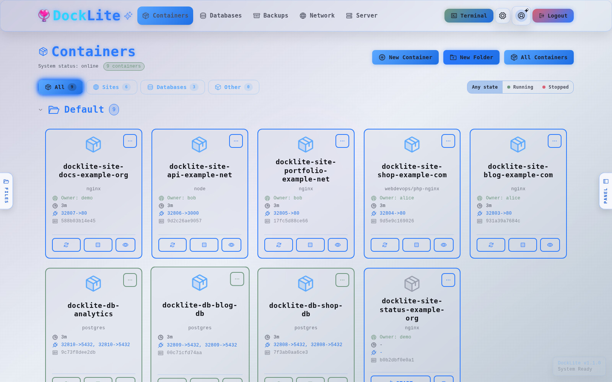<br><sub><b>Corpo Blue</b>: clean greys with cool blue</sub></td>
  </tr>
  <tr>
    <td>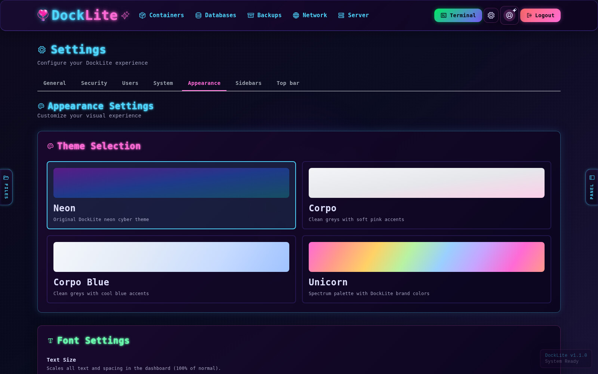<br><sub>Four themes: <b>Neon</b> (default), Corpo, Corpo Blue and Unicorn</sub></td>
    <td>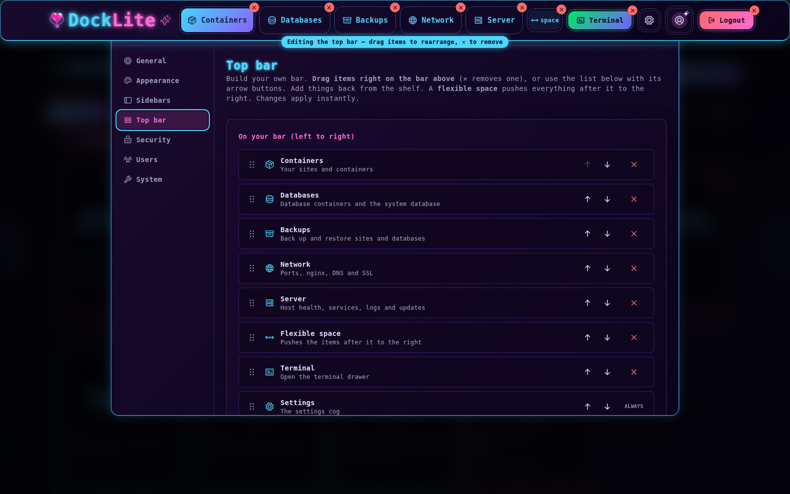<br><sub><b>Top bar editor</b>: drag, reorder, remove, add back</sub></td>
  </tr>
</table>

<sub>All screenshots are from the built-in demo mode (`scripts/demo.sh up`), which uses fake data.</sub>

## Install

You need a fresh or existing Ubuntu/Debian server and a user with `sudo`.

```bash
git clone https://github.com/girlypopicon/docklite.git
cd docklite
sudo bash install.sh
```

The installer sets up Docker, Node.js, nginx and PM2 if they are missing, builds DockLite into `/opt/docklite`,
and walks you through ports, an optional dashboard domain with HTTPS, and the firewall. Running it again later
upgrades DockLite and keeps your data and settings.

When it finishes it prints where to find the dashboard. The first login is `superadmin`; the generated password
is stored on the server:

```bash
sudo cat /opt/docklite/data/initial-admin-password
```

More detail: [docs/INSTALL.md](docs/INSTALL.md).

## First site

1. Point your domain's DNS A record at the server.
2. In the dashboard, open **Containers → New**, enter the domain and pick a type.
3. Open the site's details and issue an HTTPS certificate.

Or from the terminal:

```bash
docklite sites create example.com
docklite ssl issue example.com --www --email you@example.com
```

## The command line

```bash
docklite doctor                  # check DockLite, Docker, nginx and certificates
docklite containers list         # what is running
docklite containers restart example.com
docklite backups list
docklite docs                    # the full guide
```

Destructive commands ask first, and refuse to run from scripts without `--yes`. Every command accepts `--json`.
The guide lives in [go-app/cmd/docklite/docs/CLI.md](go-app/cmd/docklite/docs/CLI.md).

## Using DockLite on a server that already has sites

DockLite will not take over what is already there. `inventory.sh` prints a read-only report of what is on the
server, `docklite repair` checks health, and `docklite sites layout` shows (and, when you confirm, fixes) whether
sites follow the standard layout `/var/www/sites/<user>/<domain>/`. Moves copy the files, keep the old folder, and
roll back if the new container will not start.

## How it works

```
Browser -> nginx -> DockLite agent (Go) -> Docker
                         |-> Web dashboard (Next.js)
                         '-> SQLite
```

- `go-app/` – the agent (API, Docker, nginx and certificates) and the `docklite` command line.
- `webapp/` – the dashboard.
- Runs as the unprivileged `docklite` user under PM2. Sites live in `/var/www/sites/<user>/<domain>/`.
  Anything that needs root (nginx files, certificates) goes through `docklite-helper`, which accepts only a short
  list of validated operations.

For contributors: [CLAUDE.md](CLAUDE.md) has the architecture and API notes, and [docs/TESTING.md](docs/TESTING.md)
covers the tests (`make test`).

## Roadmap

Planned, not built yet: a backup scheduler and one-click restore, portable `.dklpkg` packages (a site or server
bundled to move elsewhere), adopting existing sites and cleaning up leftovers from the dashboard, an activity log
viewer, more database types, and a refreshed terminal UI.

## License

DockLite is free software under the [GNU Affero General Public License v3.0](LICENSE) (AGPL-3.0-or-later). You
can use, change and share it. If you run a modified version as a network service, you must offer its source
code to the people using it.

## Versions

Version history is in [CHANGELOG.md](CHANGELOG.md). The release process is in [CONTRIBUTING.md](CONTRIBUTING.md).
